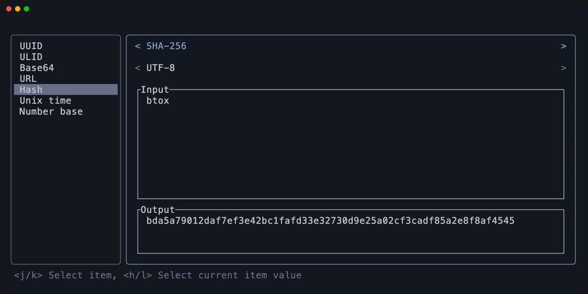
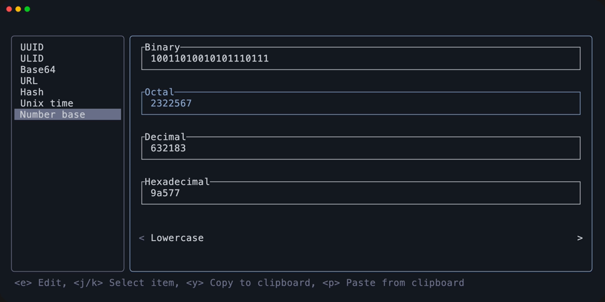

# btox

my personal toolbox app

## Usage

### Common keybindings

| Key               | Description  |
| ----------------- | ------------ |
| <kbd>j</kbd>      | cursor down  |
| <kbd>k</kbd>      | cursor up    |
| <kbd>Tab</kbd>    | toggle focus |
| <kbd>Ctrl+C</kbd> | quit         |

## Features / Screenshots

### UUID

### ULID

### Hash

### Unix time

Datetime output format follows [strftime](https://docs.rs/chrono/latest/chrono/format/strftime/index.html).

### Number base

## License

MIT
