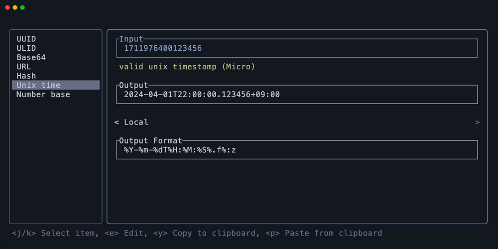

# btox

my personal toolbox app

## Usage

### Keybindings

| Key                              | Description  |
| -------------------------------- | ------------ |
| <kbd>Ctrl+n</kbd>                | cursor down  |
| <kbd>Ctrl+p</kbd>                | cursor up    |
| <kbd>Tab</kbd>                   | toggle focus |
| <kbd>Ctrl+C</kbd> <kbd>Esc</kbd> | quit         |

## Features / Screenshots

### UUID

### Hash

### Unix time

Datetime output format follows [strftime](https://docs.rs/chrono/latest/chrono/format/strftime/index.html).

### Number base

## License

MIT
