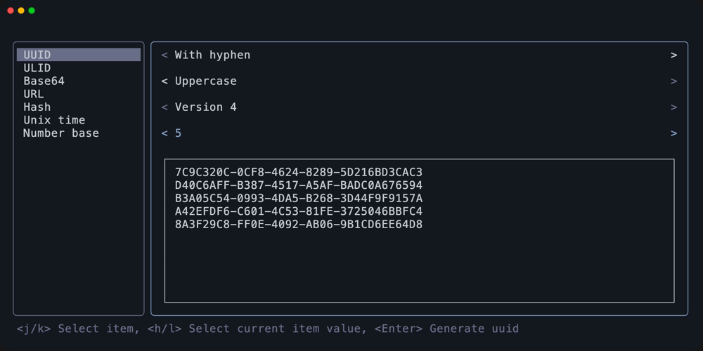

# btox

my personal toolbox app

## Usage

### Keybindings

| Key                              | Description  |
| -------------------------------- | ------------ |
| <kbd>Ctrl+n</kbd>                | cursor down  |
| <kbd>Ctrl+p</kbd>                | cursor up    |
| <kbd>Tab</kbd>                   | toggle focus |
| <kbd>Ctrl+C</kbd> <kbd>Esc</kbd> | quit         |

Detailed keybindings for each features can be displayed pressing the `?`.

## Features / Screenshots

## License

MIT
